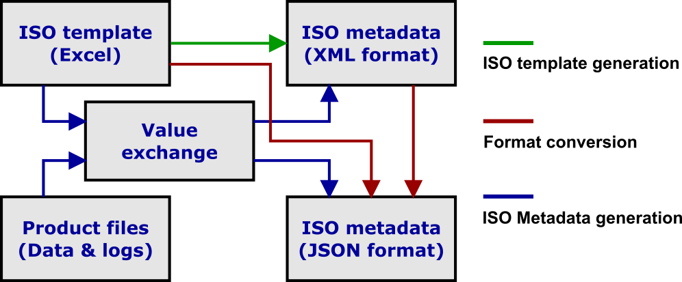
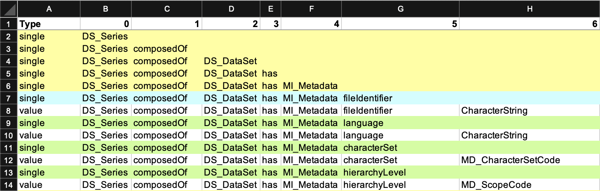
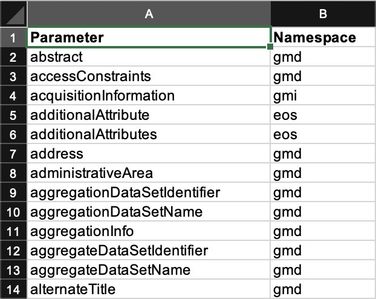
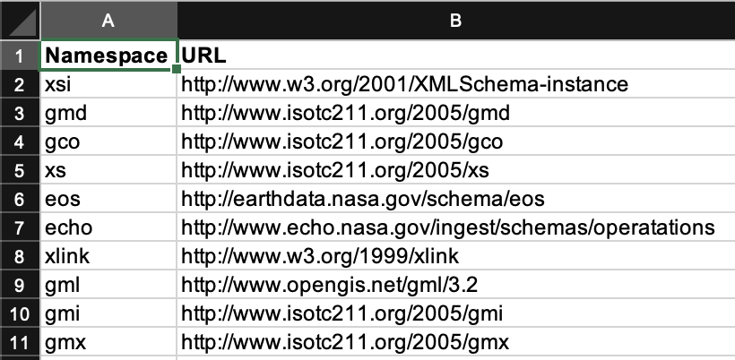

<h1>asf_metadata</h1>

This repo contains all the Python 3.8 scripts related to manage ASF metadata. These are currently mostly dealing with ISO metadata.

<h2>Table of Contents</h2>
<ul>
<li><a href="#iso-template">ISO template</a></li>
<li><a href="#excel-spreadsheet">Excel spreadsheet</a></li>
<li><a href="#iso-functions">ISO metdata functions</a></li>
<li><a href="#iso-tools">ISO metadata tools</a></li>
</ul>
 

<h2 id="iso-template">ISO template</h2>

ISO metadata templates can be best maintained in a more user-friendly environment. I have settled for an Excel spreadsheet to achieve that.

The template mechanism has three different flows. All use an Excel spreadsheet to define the structure of the ISO metadata. 

<h3>ISO metadata template generation</h3>

The ISO metadata's structure is stored in an Excel spreadsheet and contains identifiers for each metadata parameter that is variable. The structure and variables form the template that we can store in two formats: XML and JSON.

<h3>Format conversion</h3>

In order to convert the metadata between various formats, we need to know the structure of it. That is saved within an Excel spreadsheet.

This functionality is something I anticipate using for the NISAR mission, for which we only get metadata in ISO XML format. Using the structure from the spreadsheet allows to painlessly deal with the namespaces within the XML files.

<h3>ISO metadata generation</h3>

For the generation of ISO metadata, we need the structure from the Excel spreadsheet. The template parameters need to be exchanged by their actual values. This will be achieved by extracting the necessary information based on the product files, replacing the functionality that existed in the old MapReady framework.

 

<h2 id="excel-spreadsheet">Excel spreadsheet</h2>

The Excel spreadsheet has a number of worksheets.

<h3>ISO metadata structure</h3>

This worksheet provides the relevant parts of the ISO metadata, most importantly its structure and the namespaces used within that structure.

<h3>Namespaces</h3>

One of the biggest nuisances about ISO XML metadata is the namespaces.

This worksheet links each parameter to its respective namespace. 

This worksheet defines the URLs for the individual namespaces needed in the XML declarations.

 

<h2 id="iso-functions">ISO metadata functions</h2>

I developed a number of functions that perform the various tasks outline above.

<h3>Extracting information from templates</h3>

The template information in the Excel spreadsheet is extracted (using the <em>isoTemplate2lists</em> function) into a number of lists: the flattened template structure, the individual metadata parameters, and their respective values.

<h3>Conversion of metadata formats</h3>

In order to convert an XML file to JSON format, we need to extract the individual metadata parameters out of the ISO metadata XML file using the <em>get_metadata_values</em> function.

<h3>Replacing placeholders with actual values</h3>

The templates stored in the Excel spreadsheets contain ISO parameter placeholders. The <em>product_dictionary2values</em> function replaces these placeholders, saved in a product dictionary, with the actual metadata values.

<h3>Generating ISO metadata from product files</h3>

ISO metadata can be generated by extracting the necessary information based on the product files (using the generate_product_dictionary function). Depending on the product type, specific conversion functions are called:

<ul>
<li>RTC products: <em>gamma_rtc_metadata</em> function</li>
</ul>

<h3>Building metadata structures</h3>

The ISO metadata is saved in two different formats: XML and JSON. The XML is using a tree structure that is built with the <em>iso_xml_structure</em> function, while the JSON structure is formed by a complex nested dictionary using the <em>iso_dictionary_structure</em> function.

<h3>Writing metadata to file</h3>

There are two separate functions to save the metadata to a file format. <em>meta_xml_file</em> is the function that generates an ISO XML metadata file, while <em>meta_json_file</em> saves the metadata in JSON format.

<h3>Cleaning up metadata</h3>

There are two separate functions to clean up the metadata structures. <em>clean_xml_structure</em> (for XML files) and <em>clean_json_structure</em> (for JSON files) is the function that removes metadata for product files (digital elevation model, incidence angle map, scattering area map) that are only optionally included.

 

<h2 id="iso-tools">ISO metadata tools</h2>

I developed a number of tools that perform the various tasks outline above.

<h3>Generate ISO template file from Excel spreadsheet</h3>
<pre>
usage: generate_iso_template.py [-h] [-dem DEM] excelFile isoBase

Generate ISO template file from Excel spreadsheet

positional arguments:
  excelFile   name of the Excel template spreadsheet
  isoBase     basename of the ISO metadata template file

optional arguments:
  -h, --help  show this help message and exit
  -dem DEM    name of DEM template spreadsheet
</pre>

<h3>Generate ISO metadata file from Excel spreadsheet</h3>
<pre>
usage: generate_iso_metadata.py [-h] [-product PRODUCT] [-data DATA] [-dem DEM] meta_file log_file iso_base

Generate ISO metadata file from Excel spreadsheet

positional arguments:
  meta_file         file path of product metadata such as a "manifest.safe" or leader file
  log_file          name of RTC processing log file
  iso_base          basename of the ISO XML metadata file

optional arguments:
  -h, --help        show this help message and exit
  -product PRODUCT  name of the product type (default: gamma_rtc)
                    choices: ["gamma_rtc"]
  -data DATA        name of the data source (default: sentinel)
                    choices: ["sentinel"]
  -dem DEM          DEM type used for terrain correction
                    choices: ["copernicus"]
</pre>

At the moment, I have only added one function <em>gamma_rtc_log2meta</em> that analyzes GAMMA RTC log files for metadata. The corresponding product type is 'gamma_rtc'.

<h2>Author</h2>

Rudi Gens

